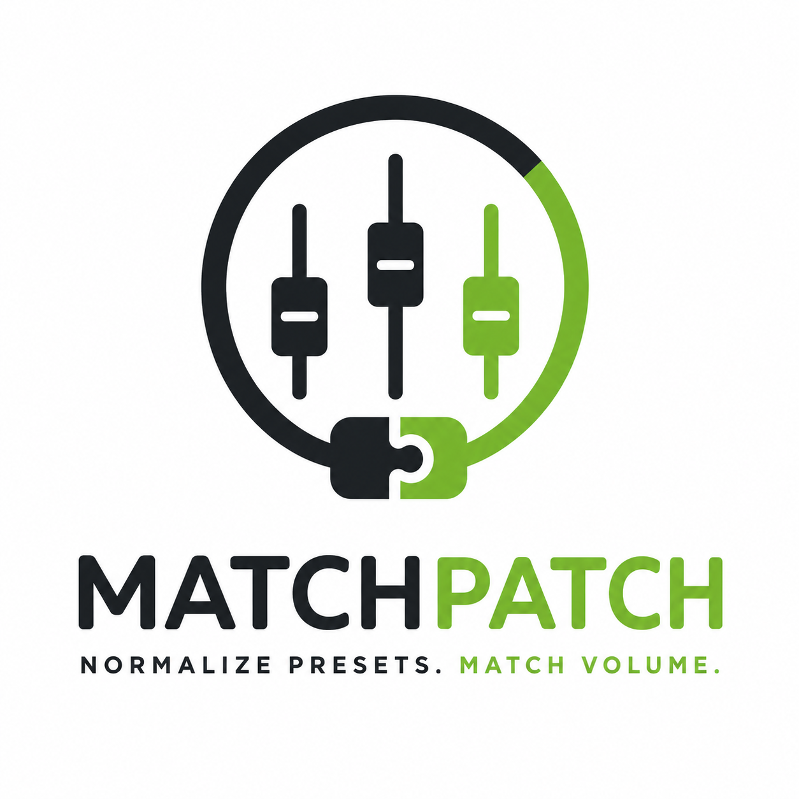
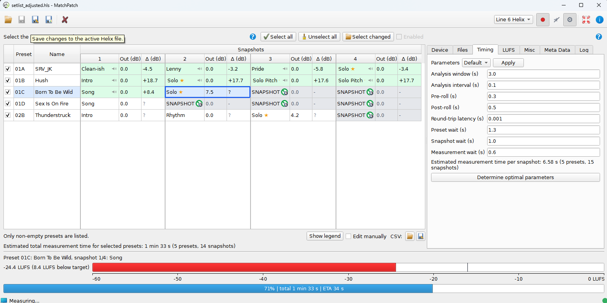

# MatchPatch

<p align="center">
  
</p>

[](https://github.com/noseglasses/MatchPatch/actions/workflows/quality.yml)
[](https://github.com/noseglasses/MatchPatch/actions/workflows/release.yml)
[](https://pypi.org/project/matchpatch/)
[](https://pypi.org/project/matchpatch/)

<p align="center">
  <strong><a href="https://youtu.be/Dw1Kez0AnCk">Watch the demo video</a></strong>
  ·
  <strong><a href="https://noseglasses.github.io/MatchPatch/">Read the documentation</a></strong>
  ·
  <strong><a href="https://github.com/noseglasses/MatchPatch/releases/latest">Download MatchPatch</a></strong>
</p>



**No more unexpected volume jumps when switching sounds.**

MatchPatch automatically equalizes the loudness of presets and snapshots in
guitar processors such as the Line 6 Helix.

## Why MatchPatch?

You create a great clean sound. You create a great lead sound. Then you switch
between them and one is much louder than the other.

MatchPatch measures your presets and calculates the gain adjustments needed to
make them consistent, so your setlist feels balanced before rehearsal or stage
use.

## Features

- Measure preset loudness automatically.
- Analyze snapshots.
- Calculate required gain corrections.
- Modify Helix setlists and presets.
- Test the workflow without hardware.
- Configure normal runs from the GUI.
- Use CLI and worker commands for advanced scripting.
- Open source.

## Current Support

Current normal workflows support:

- Line 6 Helix
- `.hls` Helix setlists
- `.hlx` Helix presets
- GUI-first workflows

Loopback and simulated modes are available for no-hardware tests. Hardware mode
is for real Helix measurement.

## Documentation

- Online manual: [noseglasses.github.io/MatchPatch](https://noseglasses.github.io/MatchPatch/)
- Start here: [docs/index.md](docs/index.md)
- 10-minute guide: [docs/quick-start.md](docs/quick-start.md)
- Main manual: [docs/musician-guide.md](docs/musician-guide.md)
- Test without hardware: [docs/workflows/test-without-hardware.md](docs/workflows/test-without-hardware.md)
- Hardware measurement: [docs/workflows/hardware-measurement.md](docs/workflows/hardware-measurement.md)
- Reference DI: [docs/concepts/reference-di.md](docs/concepts/reference-di.md)
- Troubleshooting: [docs/troubleshooting.md](docs/troubleshooting.md)
- FAQ: [docs/faq.md](docs/faq.md)
- Glossary: [docs/glossary.md](docs/glossary.md)

## Safety Notes

> Warning:
> Keep backups of your original Helix files.

> Warning:
> Measurement files are for measuring, not for live playing.

## Install And Launch

On Windows, download the latest installer from
[GitHub Releases](https://github.com/noseglasses/MatchPatch/releases/latest),
run `MatchPatch-Setup-<version>.exe`, then launch MatchPatch from the Start
Menu. The installed app bundles offline Help, available from the GUI.

For source checkouts, use the verified local setup commands below and see
[Developer Notes](docs/developer-notes.md) and
[developer commands](docs/dev/commands.md) for fuller setup details.

Install the optional GUI support and launch MatchPatch:

```bash
# Linux or WSL
scripts/sync-wsl.sh --extra gui
matchpatch-gui
```

```powershell
# Windows PowerShell
cd C:\src\MatchPatch-windows
.\scripts\sync-windows.cmd --extra gui
.\.venv-windows\Scripts\matchpatch-gui.exe
```

Hardware measurement from WSL needs a synced native Windows runtime. See
[developer commands](docs/dev/commands.md) before using real Helix hardware from
WSL.

## Advanced And Developer Information

Technical details live in the developer docs:

- [Developer Notes](docs/developer-notes.md)
- [Architecture](docs/dev/architecture.md)
- [Commands](docs/dev/commands.md)
- [File Formats](docs/dev/file-formats.md)

## License

MatchPatch is open source software released under the [MIT License](LICENSE).
