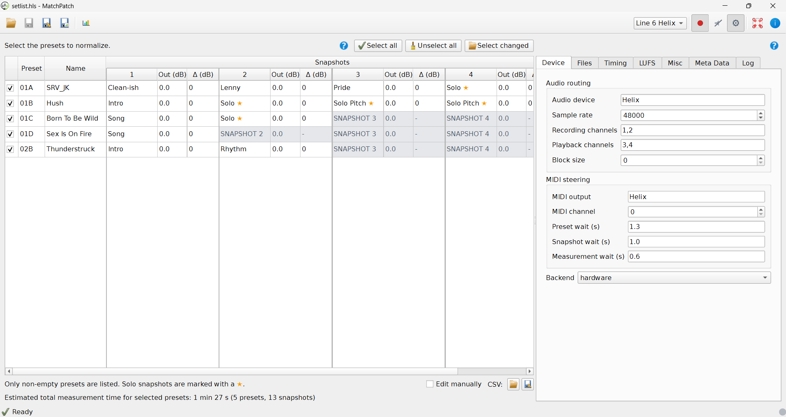

# Developer Notes

This page is for maintainers. It is not part of the normal musician manual.

If you are using MatchPatch to balance presets, start at [MatchPatch Docs](index.md)
instead.

## Documentation Goal

The main docs should help musicians use MatchPatch without needing to understand
software development.

Write for someone who knows:

- Helix presets;
- snapshots;
- guitar levels;
- loudness by ear;
- basic audio routing ideas.

Do not assume they know:

- Python;
- Git;
- command lines;
- JSON;
- package environments;
- source code structure.

## Main Source Files

Use these files when updating docs:

- `PROGRAM_DESCRIPTION.md`: broad program description, workflows, GUI elements,
  CLI commands, errors, and glossary.
- `MATCH_PATCH_FEATURES.md`: detailed GUI feature inventory.
- `README.md`: setup and project overview.
- `docs/dev/architecture.md`: technical architecture.
- `docs/dev/commands.md`: development and CLI command reference.
- `docs/dev/file-formats.md`: technical file-format details.

Use developer docs only to confirm facts. Translate those facts into musician
language before adding them to user-facing pages.

## Where Content Belongs

Use this split:

- `docs/index.md`: short entry point and table of contents.
- `docs/quick-start.md`: fastest safe first run.
- `docs/musician-guide.md`: main non-technical manual.
- `docs/workflows/`: step-by-step tasks.
- `docs/concepts/`: explanations of ideas.
- `docs/troubleshooting.md`: problem solving.
- `docs/faq.md`: short answers.
- `docs/glossary.md`: short definitions.
- `docs/developer-notes.md`: maintenance guidance.
- `docs/dev/`: technical details.

Do not put implementation details in normal user pages unless they directly help
the musician avoid a mistake.

## Voice And Style

Use:

- short steps;
- plain guitar-player language;
- practical examples;
- warnings before risky actions;
- screenshot placeholders where a picture would help;
- links to concepts instead of repeating long explanations.

Avoid:

- code names;
- stack traces;
- internal class or function names;
- long command sequences in user pages;
- explaining how the software is built.

## Screenshot Guidance

Screenshots should show realistic musician workflows.

Recommended screenshot groups:

- empty startup window;
- loaded setlist;
- single preset with temporary slot;
- backend selector;
- hardware settings;
- timing tab;
- parameter study dialog;
- result table;
- red warning row;
- save dialogs.

Use paths such as:

```text
docs/assets/screenshots/open-setlist.png
```

When replacing placeholders, add helpful alt text.

Example:

```markdown

```

Do not include private file paths or personal preset names in screenshots unless
they are intentionally anonymized.

## Keeping Pages Consistent

Use these terms consistently:

- Reference DI.
- Target LUFS.
- Measurement file.
- Adjusted file.
- Backend.
- Hardware mode.
- Loopback mode.
- Simulated mode.
- Snapshot.
- Solo boost.
- Ignored snapshot.

When adding a new term, update [Glossary](glossary.md).

## Advanced Configuration

Most musicians should configure MatchPatch from the GUI. Use TOML only for
durable machine defaults, repeated CLI runs, or advanced setup notes.

MatchPatch automatically loads the first existing default config file from this
search path:

- Windows: `%APPDATA%\MatchPatch\config.toml`
- Windows fallback: `%USERPROFILE%\.config\matchpatch\config.toml`
- Linux/WSL/macOS with `XDG_CONFIG_HOME`: `$XDG_CONFIG_HOME/matchpatch/config.toml`
- Linux/WSL/macOS fallback: `~/.config/matchpatch/config.toml`

Use `--config PATH` or the GUI Files tab to load another file. Command-line
options override the file. The `MATCHPATCH_BACKEND`,
`MATCHPATCH_WINDOWS_PYTHON`, and `MATCHPATCH_REFERENCE_DI` environment
variables override matching file values.

Use `--snapshot-count N` to override `policy.measured_snapshots` for one run.
Line 6 Helix supports between `1` and `8` measured snapshots; the default is
`4`.

Export the default config:

```bash
matchpatch --export-default-config ~/.config/matchpatch/config.toml
```

On installed Windows builds, the matching default export target is:

```powershell
MatchPatch.exe --cli --export-default-config "$env:APPDATA\MatchPatch\config.toml"
```

Example config:

```toml
[normalize]
backend = "hardware"
reference_di = "/path/to/reference-di.wav"
target_lufs = -16.0
timeout_seconds = 300

[devices.helix.audio]
device = "Helix"
sample_rate = 48000
input_mapping = [1, 2]
output_mapping = [3, 4]
blocksize = 0

[devices.helix.steering]
output = "Helix"
channel = 0
preset_wait_seconds = 0.5
snapshot_wait_seconds = 0.2
measurement_wait_seconds = 0.1

[policy]
measured_snapshots = 4
solo_regex = '(?i)\bsolo\b'
solo_gain_bump_db = 3.0
crest_factor_reference_db = 12.0
crest_factor_correction_ratio = 0.4
max_crest_factor_correction_db = 3.0
gain_deadband_db = 0.25

[analysis]
window_seconds = 3.0
interval_seconds = 0.1
minimum_valid_lufs = -100.0
pre_roll_seconds = 0.2
post_roll_seconds = 0.1
round_trip_latency_seconds = 0.02
```

## Updating For New GUI Features

When the GUI changes:

1. Update `MATCH_PATCH_FEATURES.md` if the feature inventory changes.
2. Update affected workflow pages.
3. Update affected concept pages.
4. Add or replace screenshots.
5. Update FAQ or troubleshooting if the change affects common questions.
6. Keep technical details in `docs/dev/` unless users need them.

## Updating For New Devices

When MatchPatch supports another processor:

1. Add musician-facing supported-device notes.
2. Add any new file types to the relevant user pages.
3. Add device-specific workflow notes only where they matter.
4. Avoid making Helix-specific guidance sound universal.
5. Add technical details to `docs/dev/`, not the musician manual.

## Checks For Docs-Only Changes

Run a whitespace check:

```bash
git diff --check -- docs
```

If user-facing content changed, also read:

1. `docs/index.md`
2. `docs/quick-start.md`
3. the changed workflow or concept page
4. `docs/troubleshooting.md` if errors or warnings changed

## Current Technical References

- [Architecture](dev/architecture.md)
- [Commands](dev/commands.md)
- [File Formats](dev/file-formats.md)
