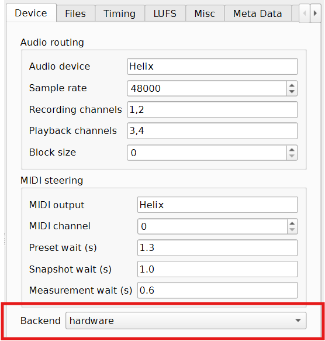
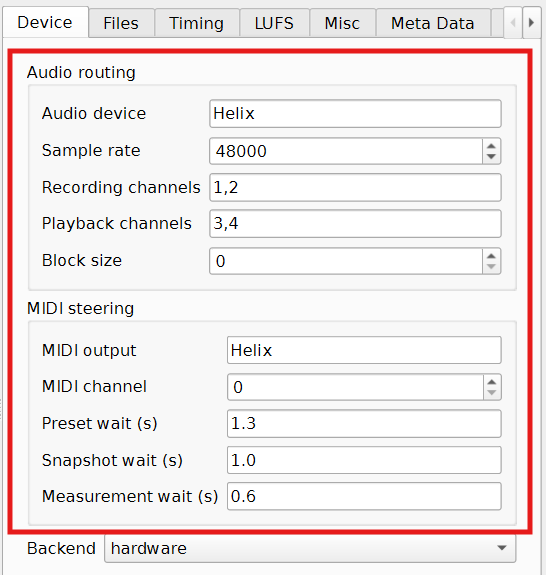

(help-hardware-measurement)=
# Hardware Measurement

Use hardware mode when you want MatchPatch to measure your real Line 6 Helix or
Pod Go.

Hardware mode gives the results you should use for rehearsal, stage preparation,
and final setlist balancing.

## Before You Start

- Connect the processor by USB.
- Make sure the processor is powered on.
- Make sure your computer can see the processor audio device.
- Make sure your computer can see the processor MIDI output.
- Have a reference DI WAV ready.
- Back up your original `.hls`, `.hlx`, `.pgs`, or `.pgp` file.
- Run preflight check from Advanced > Diagnostics before your first hardware
  measurement.

See also:

- [Backends](../concepts/backends.md)
- [Reference DI](../concepts/reference-di.md)
- [Routing And Levels](../concepts/routing-and-levels.md)

## What Hardware Mode Does

MatchPatch sends the reference DI to the processor, switches presets and snapshots,
records the processed sound, and measures the loudness.

The processor is doing the real tone work. MatchPatch is listening and
calculating the output-level changes.

## Check The Backend

1. Open Advanced.
2. Go to the Device tab.
3. Set Backend to `hardware`.




## Run Preflight First

Before the first real measurement, open Advanced > Diagnostics and click Run
preflight check. The check validates the file selection, preset selection,
reference DI, resolved settings, and hardware setup before MatchPatch starts
recording.

In hardware mode, the hardware checks validate the selected audio device,
recording and playback channels, MIDI output, MIDI channel, and timing values
used by the native Windows worker.

If Preflight reports a failure, fix that item before starting normalization. If
you need help, use Export diagnostic bundle from the same tab and include the
bundle in a bug report.


(help-hardware-routing)=
## Check Audio Routing

In the selected device settings, check:

- Audio device.
- Recording channels.
- Playback channels.
- Sample rate.
- Block size.

For many Helix and Pod Go setups:

- processed audio returns on USB `1/2`;
- the reference DI is sent to processor USB `3/4`.

Your own system may differ.



(help-midi-steering)=
## Check MIDI Steering

In the selected device settings, check:

- MIDI output.
- MIDI channel.
- Preset wait.
- Snapshot wait.
- Measurement wait.

MIDI steering is how MatchPatch changes presets and snapshots during the run.


(help-macos-hardware-validation)=
## Validate On macOS

Use the macOS validation harness before installer work or when checking a new
Mac build. It proves that the hardware dependencies import cleanly, the app can
list Core Audio and CoreMIDI devices, and the native hardware diagnostics fail
cleanly when no Helix or Pod Go is attached.

Run the harness from the repository root:

```bash
scripts/test-macos-hardware.sh
```

The GitHub-hosted macOS job runs this in expected-failure mode with no device
attached. If you have a self-hosted macOS runner with Helix and Pod Go
connected, set `MATCHPATCH_MACOS_HARDWARE=1` and rerun the same script so the
diagnostics must pass.

If you want to capture the exact device names and channel mapping results by
hand, run:

```bash
uv run --frozen --no-default-groups --extra hardware python -m matchpatch.measure devices \
  | tee build/macos-hardware/device-list.txt
uv run --frozen --no-default-groups --extra hardware python -m matchpatch.measure check-hardware \
  --device helix --diagnostics-json > build/macos-hardware/helix-diagnostics.json \
  2> build/macos-hardware/helix-diagnostics.stderr.txt
uv run --frozen --no-default-groups --extra hardware python -m matchpatch.measure check-hardware \
  --device podgo --diagnostics-json > build/macos-hardware/podgo-diagnostics.json \
  2> build/macos-hardware/podgo-diagnostics.stderr.txt
```

Record the `Audio devices:` line that names the Core Audio interface, the
`MIDI outputs:` line that names the CoreMIDI port, and the JSON fields for
`audio_device.detail.device`, `audio_device.detail.input_mapping`,
`audio_device.detail.output_mapping`, `midi_output.detail.output`, and
`midi_output.detail.channel`.


## Run The Hardware Check

When you start a hardware run, MatchPatch checks whether the backend is
available.

If the check succeeds, measurement continues.

If the check fails, MatchPatch shows an error. Check USB connection, audio
device name, MIDI output name, and whether the processor is powered on. The error
uses the same structured hardware checks that Preflight and diagnostic bundles
save for troubleshooting.


(help-recorded-output-playback)=
## Use Recorded-Output Playback

The toolbar can record measured output and play it back.

Use this to confirm MatchPatch actually recorded the processed signal. If
you hear silence or the wrong sound, check routing before trusting the results.

## What Success Looks Like

- Hardware check passes.
- Presets switch on the processor during measurement.
- Snapshot changes happen during measurement.
- The loudness bar updates.
- Recorded-output playback sounds like the processed tone.
- The result table does not show unexpected red warnings.

## If Something Goes Wrong

- If hardware is not found, check USB, audio device, and MIDI output.
- If recorded-output playback is silent, check routing.
- If rows are red, use Default timing and check [Troubleshooting](../troubleshooting.md).
- If measurements vary, read [Measurement Timing](../concepts/timing.md).

> Warning:
> Wrong USB channels can record silence. Silence often causes bad LUFS or
> implausible output-gain warnings.

> Warning:
> Use slower timing for presets with long delay or reverb trails. Fast timing can
> make one snapshot bleed into the next measurement.
