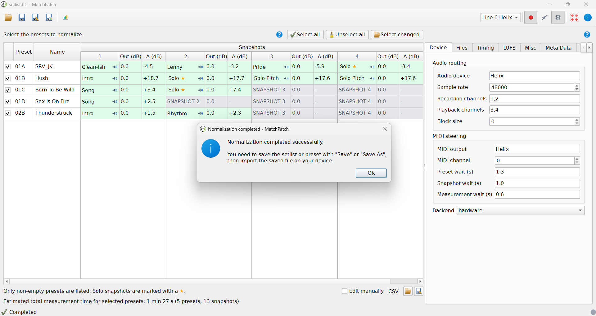

(help-normalize-setlist)=
# Normalize A Setlist

Use this workflow to balance a Helix `.hls` setlist with many presets.

This is the main MatchPatch workflow for a rehearsal or gig setlist.

## Before You Start

- Back up the original `.hls` file.
- Choose a reference DI.
- Decide whether this is a real hardware run or a no-hardware test.
- If using hardware mode, connect and power on the Helix.
- Set aside enough time for the selected presets and snapshots.

Useful background:

- [Reference DI](../concepts/reference-di.md)
- [Backends](../concepts/backends.md)
- [Reading Results](../concepts/reading-results.md)

## Steps

1. Open MatchPatch.
2. Open your `.hls` setlist.
3. Wait for the preset table to appear.
4. Review the listed presets. MatchPatch shows only non-empty presets.
5. Choose which presets to measure:
   - leave presets checked if they should be included;
   - uncheck presets you do not want to measure;
   - use Select all for the whole setlist;
   - use Unselect all to start over;
   - use Select changed if you only want presets changed since another setlist.
6. Open Advanced.
7. Choose the backend in the Device tab.
8. Check the Reference DI in the Files tab.
9. Set Target LUFS, solo boost, solo name rule, and ignored snapshot rule in the
   LUFS tab if needed.
10. Check snapshot count in the Misc tab.
11. If using hardware, confirm audio routing and MIDI steering in the Device tab.
12. Click Start normalization.
13. Follow any import prompts MatchPatch shows.
14. Watch the progress area while MatchPatch measures presets and snapshots.
15. Review the result table.
16. If the table looks good, click Save or Save As.
17. Import the saved adjusted file into the Helix.
18. Listen through the setlist in a real playing context.

(help-preset-table-legend)=
## Preset Table Legend

Use the Show legend button under the preset table to display the current table
legend.

(help-select-presets)=
## Preset Selection Tips

Use Select all when you want a complete setlist pass.

Use Unselect all when you want to choose only a few songs.

Use Select changed when you have an older version of the same setlist and only
want to measure presets whose sound changed.

You can still adjust the selected presets manually after Select changed.

## Import Prompts

In hardware workflows, MatchPatch may ask you to import a measurement file
before measurement can continue.

Follow the prompt exactly. The measurement file is temporary and exists only so
MatchPatch can measure the Helix correctly.

> Warning:
> Measurement files are not live-performance files.

## Reviewing Results

Before saving, check for:

- red highlighted rows;
- unexpected `-` ignored snapshots;
- surprising large gain changes;
- snapshots that should have been solo but were not marked with a star;
- snapshots that should not have been measured.

If a row is red, read [Troubleshooting](../troubleshooting.md) before saving.

## What Success Looks Like

- Measurement finishes without unexpected red rows.
- The result table shows sensible Delta dB values.
- Solo snapshots are marked correctly.
- Ignored snapshots are grey and intentionally skipped.
- Save or Save As writes an adjusted file.
- The adjusted file sounds balanced after import.

## If Something Goes Wrong

- If the Helix is not found, check [Hardware Measurement](hardware-measurement.md).
- If the result table has red rows, check
  [Reading Results](../concepts/reading-results.md) and
  [Troubleshooting](../troubleshooting.md).
- If the wrong snapshots are skipped, check
  [Snapshots, Solos, And Ignored Snapshots](../concepts/snapshots-solos-and-ignored.md).

> Warning:
> Keep the original setlist until you have listened to the adjusted file on the
> Helix.
