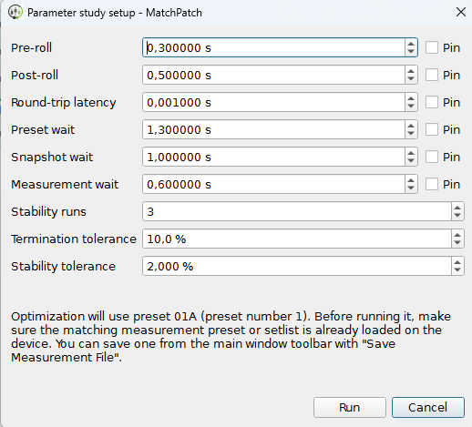
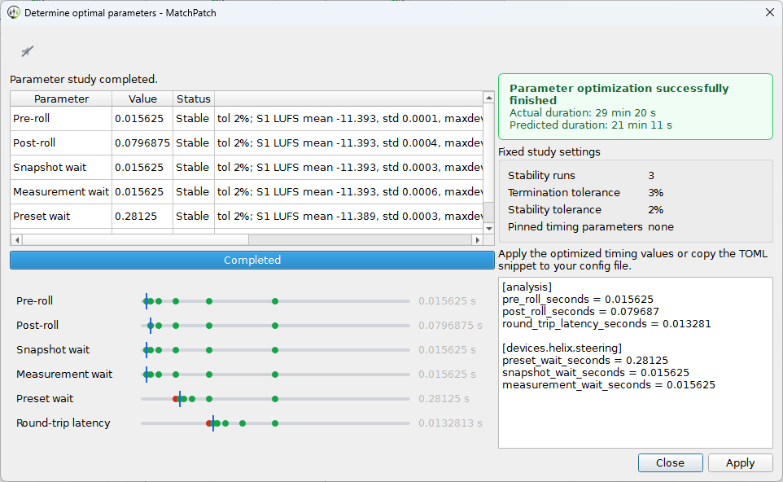

(help-optimize-timing)=
# Optimize Timing

Use this workflow when hardware measurements are unstable or when you want
MatchPatch to find faster reliable timing values.

Timing controls how long MatchPatch waits around preset changes, snapshot
changes, and audio recording.

See also: [Measurement Timing](../concepts/timing.md).

## When To Use This

Use Determine optimal parameters when:

- repeated measurements do not agree;
- presets have long delay or reverb trails;
- the Helix seems slow to switch;
- Fast timing gives suspicious results;
- you want shorter timing without guessing.

## Before You Start

- Open a setlist or preset.
- Select at least one preset that can be measured.
- Check the Reference DI.
- If using hardware mode, connect and prepare the Helix.
- If using a single `.hlx`, enter the temporary preset slot.

> Warning:
> Parameter studies can take time. Let the run finish unless you need to abort.

## Steps

1. Open Advanced.
2. Go to the Timing tab.
3. Click Determine optimal parameters.
4. Review the setup dialog.
5. Adjust starting values if needed.
6. Pin any value you do not want MatchPatch to change.
7. Set stability runs and tolerances if needed.
8. Click Run.
9. Watch the parameter study window.
10. When the result appears, click Apply.
11. Confirm the Timing tab values have changed.
12. Run normalization with the new timing.

## What Pin Means

Pin means "keep this value as it is." MatchPatch skips optimizing pinned values.

Use Pin when you already know a value is correct or you do not want it shortened.

## Stability Runs

Stability runs are repeated checks. More runs give more confidence but take
longer.

Use the default first unless you are chasing a difficult measurement problem.

## Tolerances

Tolerances decide how close repeated measurements must be to count as stable.

Smaller tolerances are stricter. Stricter settings can take longer or fail more
often.

## Stable And Unstable

Stable means the measurement repeated closely enough.

Unstable means the measurement changed too much. This often means the timing is
too fast, trails are still ringing, or routing/playback is not steady.

## Runtime Estimate

The optimization dialog shows an estimated worst-case runtime. The real time can
be shorter, but use the estimate to decide whether this is a good moment to run
the study.

(help-apply-optimized-timing)=
## What Success Looks Like

- The study finishes.
- The result text appears.
- Apply is enabled.
- Clicking Apply updates timing values in the GUI.
- A new normalization run is more stable.

> Warning:
> Do not use very fast timing with long delay or reverb trails unless you have
> tested it.

If the study fails, see [Troubleshooting](../troubleshooting.md).
