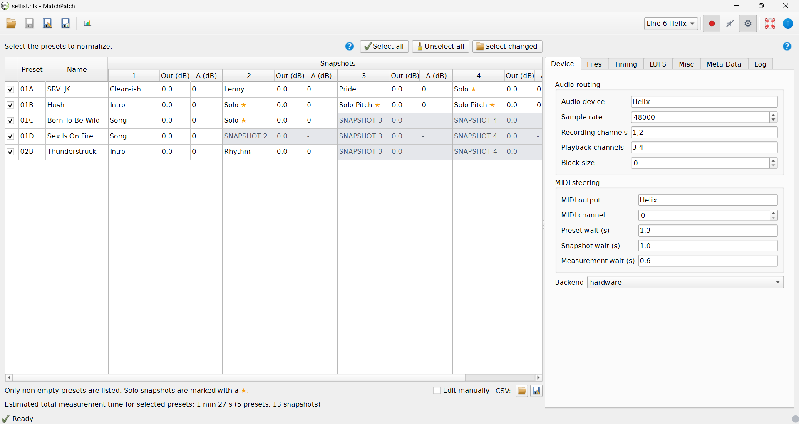

(help-select-changed)=
# Select Changed Presets

Use this workflow when you have edited only part of a setlist and do not want to
remeasure everything.

MatchPatch compares your current setlist to an older version and keeps only
changed snapshots measurable. Unchanged snapshots are grey and marked with the
`C` ignore icon.

## Before You Start

- Have the current `.hls` or `.pgs` setlist.
- Have the previous `.hls` or `.pgs` setlist.
- Make sure both files are versions of the same setlist.
- Back up the current file.

> Warning:
> This workflow is for `.hls` and `.pgs` setlists. It is not for single-preset
> files.

## Steps

1. Open MatchPatch.
2. Open the current `.hls` or `.pgs` setlist.
3. Click Select changed.
4. Choose the previous setlist for the same device family.
5. Review which snapshots are still measurable.
6. Manually check or uncheck presets if needed.
7. Run normalization.

## What Counts As Changed?

The goal is to find snapshots whose sound changed. Renamed presets and renamed
snapshots may not count as changed if the tone itself is the same.

If a preset's block layout or non-snapshot parameters changed, MatchPatch keeps
all snapshots in that preset measurable. Otherwise it compares each snapshot's
parameter assignments independently.

This is useful after rehearsal when you changed a few tones but kept most of the
setlist untouched.

## If No Snapshots Are Measurable

If no snapshots are measurable:

- you may have chosen the wrong previous file;
- the setlist may not have changed in a way MatchPatch needs to measure;
- the changes may only be names or other non-sound details.

You can still select presets manually.

## What Success Looks Like

- Changed snapshots remain normal table cells.
- Unchanged snapshots are grey and show the `C` ignore icon.
- Preset checkboxes still let you exclude whole presets.
- Normalization runs on the smaller selection.

## If Something Goes Wrong

- If no presets are selected, confirm you chose the correct previous setlist.
- If the file is rejected, confirm both files are the same supported setlist
  type.
- If the selected presets look wrong, adjust the checkboxes manually.
- If you are unsure, run [Normalize A Setlist](normalize-setlist.md) with a
  manual preset selection.

> Warning:
> Use the previous version of the same setlist, not a different bank of songs.

See also: [Normalize A Setlist](normalize-setlist.md).
